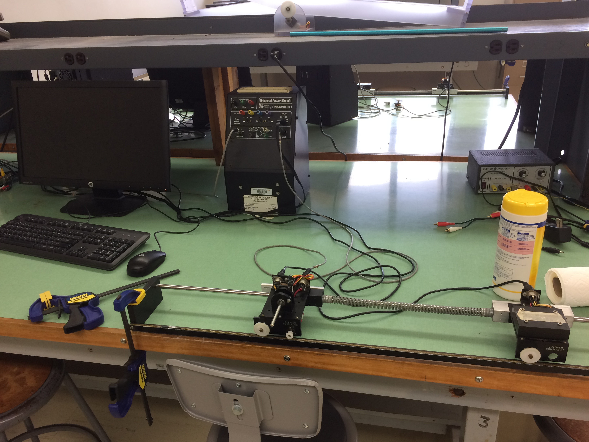

TA Manual for the UCSB ECE Controls Lab
===========================================

This document guides Teaching Assistants in setting up the Quanser inverted pendulum hardware in Harold Frank Hall 3120A that we use in the controls classes (ECE 147) in the Electrical and Computer Engineering department at the University of California, Santa Barbara. 

By Justin Pearson, Jan 2017

*This lab manual is dedicated to the legions of Graduate Students who struggled to set up this hardware the day before their first lab.*

*It is also dedicated to Paul Gritt, Avery Juan, and Raul Ramirez for diligently and patiently maintaining these labs against the destructive force of countless students over the years.*

This file lives at

- <https://github.com/justinpearson/UCSB-Quanser-Inverted-Pendulum-Lab-Manual>

and also

- <http://ece.ucsb.edu/~jppearson/ECE147C/Lab0/Lab0_ForStudents.tar.gz>

If you improve it, please send me a GitHub pull request so we can help future generations of TAs. Thanks.

Instructions
----------------

1. Set up the hardware as described in the document `hardware_setup.odg` / `pdf`. In the process, you will run the Matlab Simulink files:

- `read_sensors.mdl` (reads motor-cart & springy-cart angle sensors)
- `read_sensors_and_run_motor.mdl` (same, but also writes voltage to motor)

The mdl file `read_sensors_and_run_motor.mdl` runs for 10 seconds. It sends a 1-Hz sinusoidal voltage to the motor and records the encoders of the motor-cart and springy-cart. Upon completion, the simulation dumps the sensor data into the Matlab workspace.

2. In Matlab R2011b, run the Matlab script `do_correlation_method.m`. You will need to edit the script a bit to reflect your own data. This script uses the "correlation method" (taught in the first week of ECE147C) to find the magnitude and phase of the "motor voltage to encoder angle" transfer function evaluated at the frequency that you 1-Hz.

3. Compare your result with the results in `do_correlation_method/do_correlation_method.html`, which shows an example run when I did it. The html file was made by using Matlab to "publish" the Matlab script `do_correlation_method.m`.

Building the PDF of this documentation (Mac)
---------------------------------------------

Running the script `make-lab-manual.sh` produces the pdf `lab-manual.pdf`, which contains

- this document (`README.md`)
- the slides to set up the hardware `hardware_setup.pdf`
- the m-file `do_correlation_method.m`

This `lab-manual.pdf` is meant to be printed out and kept in the Controls Lab.

Here is a typical terminal output:

    $ ./make-lab-manual.sh 

    Creating lab-manual.pdf.
    Assuming you're on a Mac with LibreOffice, pandoc, xelatex, wkhtmltopdf, and Automator.
    ===========================================
    hardware_setup.odg to pdf...
    convert /Users/justin/Projects/TA-Guide-to-UCSB-Controls-Lab/UCSB-Quanser-Inverted-Pendulum-Lab-Manual/hardware_setup.odg -> /Users/justin/Projects/TA-Guide-to-UCSB-Controls-Lab/UCSB-Quanser-Inverted-Pendulum-Lab-Manual/hardware_setup.pdf using filter : draw_pdf_Export
    Overwriting: /Users/justin/Projects/TA-Guide-to-UCSB-Controls-Lab/UCSB-Quanser-Inverted-Pendulum-Lab-Manual/hardware_setup.pdf
    ===========================================
    README.md to .tex...
    ===========================================
    README.tex to .pdf...
    This is XeTeX, Version 3.14159265-2.6-0.99996 (TeX Live 2016) (preloaded format=xelatex)
     restricted \write18 enabled.
    entering extended mode
    This is XeTeX, Version 3.14159265-2.6-0.99996 (TeX Live 2016) (preloaded format=xelatex)
     restricted \write18 enabled.
    entering extended mode
    ===========================================
    Matlab-published m-file html to pdf...
    Loading pages (1/6)
    Counting pages (2/6)                                               
    Resolving links (4/6)                                                       
    Loading headers and footers (5/6)                                           
    Printing pages (6/6)
    Done                                                                      
    ===========================================
    Concatenating pdf...
    ===========================================
    Clean up...